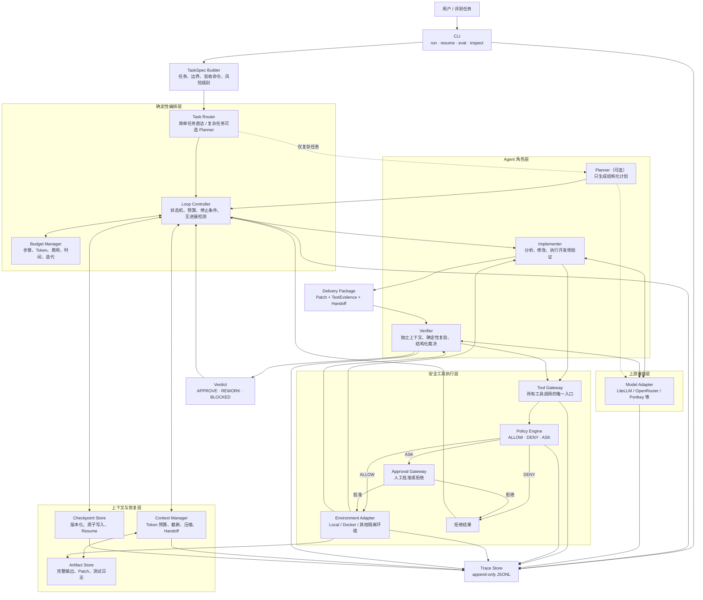
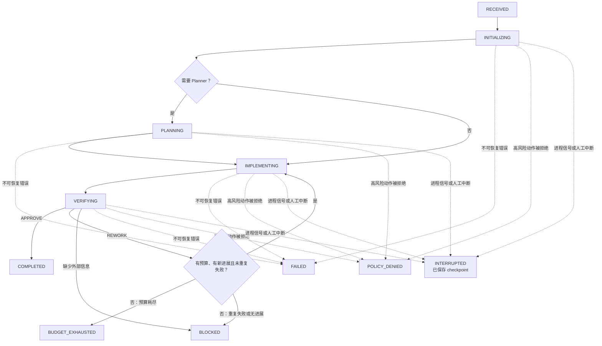

# Reliable-MiniSWE 系统架构与主链路

本文档定义 P1-02 的目标架构。它以原版 mini-swe-agent 简洁、可替换的
Model–Agent–Environment 边界为基础，增加可恢复上下文、Maker–Checker 验收循环、
有界 Loop、安全策略和轨迹级评测能力。

本文只确定模块边界、数据流和控制流。字段的最终 Python 类型由 P1-03 定义，终止状态
与退出码由 P1-04 固化，配置项由 P1-05 固化，关键取舍由 P1-06 的 ADR 记录。

## 设计原则

1. **确定性 Harness 控制循环**：状态迁移、预算、安全检查、持久化和终止条件由代码
   决定，不能依赖模型“自觉停止”。
2. **Agent 职责分离**：Implementer 负责修改，Verifier 独立验收；二者不共享无限聊天
   历史，只传递结构化交付包。
3. **所有工具调用经过同一入口**：Agent 不能绕过 Tool Gateway 直接调用 Shell；每个
   动作必须先经过 Policy Engine。
4. **状态、事实和大对象分开保存**：Checkpoint 保存恢复所需状态，Trace Store 保存
   append-only 事实，Artifact Store 保存完整输出、Patch 和测试日志。
5. **失败必须有界且可解释**：预算耗尽、重复失败、无有效 Diff、策略拒绝和不可恢复
   错误都对应明确终止原因。
6. **兼容原版最小内核**：继续使用可替换的 Model 和 Environment 适配器，不把项目扩展
   成重型平台。

## 系统总架构



图中实线表示主运行链路，虚线表示按任务复杂度选择的可选 Planner。Trace Store 接收
各模块的事件，但不反向控制业务流程。

## 模块职责与边界

| 模块 | 负责 | 明确不负责 |
|---|---|---|
| TaskSpec Builder | 将用户输入规范化为任务目标、仓库、可修改边界、验证命令、完成条件和风险级别 | 不执行任务，不让模型自行补写安全边界 |
| Task Router | 根据确定性复杂度信号决定直达 Implementer，还是先调用可选 Planner | 不维护运行状态，不参与代码验收 |
| Planner（可选） | 为复杂任务生成结构化步骤、风险和验证计划 | 不修改文件；简单任务不启动，避免 Multi-Agent 过度设计 |
| Loop Controller | 唯一的阶段状态机；驱动实现、验收、返工与终止，检查预算和无进展条件 | 不直接生成代码，不直接执行 Shell |
| Budget Manager | 统一统计并限制迭代、步骤、Token、费用和总耗时 | 不判断任务是否正确完成 |
| Implementer | 分析 TaskSpec、修改代码、运行开发侧测试，生成 Delivery Package | 不能批准自己的结果，不能绕过 Tool Gateway |
| Verifier | 在独立上下文中检查需求、Patch 和测试证据，必要时复跑确定性验证并输出裁决 | 不继承 Implementer 的聊天历史，不直接修改源码 |
| Context Manager | 调用前估算 Token；截断或外置长输出；压缩旧历史；生成结构化 Handoff | 不决定任务状态，不吞掉可追溯证据 |
| Tool Gateway | 承接所有模型工具调用，规范化参数并执行策略判定 | 不自行放行高风险动作 |
| Policy Engine | 依据确定性规则返回 `ALLOW`、`DENY` 或 `ASK`，并记录规则 ID 和原因 | 不使用 LLM 代替关键安全判断 |
| Approval Gateway | 在 `ASK` 时获得明确人工决定；非交互模式默认安全退出 | 不把沉默或超时视为批准 |
| Environment Adapter | 在选定的本地或隔离环境中执行已授权动作，施加命令超时和输出限制 | 不接收未经 Policy Engine 判定的动作 |
| Checkpoint Store | 在稳定状态边界原子保存可恢复状态，校验版本并支持 resume | 不保存完整聊天和大型命令输出 |
| Trace Store | 以 JSONL 追加模型、工具、策略、上下文、验收和终止事件 | 不作为可变运行状态或恢复快照 |
| Artifact Store | 保存完整 stdout/stderr、Patch、测试日志、压缩前内容等大对象，返回内容摘要和引用 | 不决定保留哪些上下文，也不驱动状态迁移 |
| Model Adapter | 复用上游供应商兼容、工具格式解析、费用采集和 API 重试能力 | 不拥有 Loop、Policy 或最终验收权 |

## 核心数据契约

下面列出模块之间必须出现的信息。这里是逻辑契约，P1-03 会将其固化为类型化 Schema。

### TaskSpec

```json
{
  "task_id": "weather-http-error",
  "goal": "修复 weather.py 启动时报错",
  "workspace": "/workspace/weather-mcp",
  "editable_paths": ["weather.py", "tests/**"],
  "verification_commands": ["pytest -q"],
  "acceptance_criteria": ["模块可以导入", "HTTP 请求失败时正常降级"],
  "risk_level": "LOW"
}
```

### Delivery Package

Implementer 完成一轮工作后，只通过以下结构化交付包与 Verifier 交接：

```text
TaskSpec 引用
+ Patch / modified_files
+ TestEvidence（命令、返回码、日志 Artifact 引用）
+ Handoff（已完成、失败项、下一步）
+ TraceSummary（步骤、Token、费用、策略事件）
```

完整聊天历史不属于交接内容。Verifier 获得独立上下文，避免被 Implementer 的自我判断
和长历史污染。

### Verifier Verdict

Verifier 只能返回三种裁决：

```json
{
  "decision": "APPROVE | REWORK | BLOCKED",
  "reason": "裁决原因",
  "evidence": ["验证命令与返回码、失败断言或缺失条件"],
  "required_changes": ["REWORK 时必须完成的修改"],
  "missing_information": ["BLOCKED 时缺少的信息"]
}
```

- `APPROVE` 必须有通过验收标准的证据。
- `REWORK` 必须指出可执行的修改要求，不能只说“继续优化”。
- `BLOCKED` 只用于缺少外部信息或能力、无法继续推进的情况。

### Policy Decision

每次工具执行前必须产生：

```json
{
  "decision": "ALLOW | DENY | ASK",
  "rule_id": "workspace.path_boundary",
  "reason": "目标路径超出 TaskSpec.workspace",
  "action_digest": "sha256:..."
}
```

策略至少覆盖工作目录、路径穿越和符号链接、凭证读取、日志脱敏、网络域名、Git Remote、
破坏性命令、执行超时和输出上限。

### Checkpoint、Trace 与 Artifact

三类存储必须通过 ID 互相引用，但不能混为同一文件：

```text
Checkpoint = 恢复执行所需的最新一致状态
Trace      = 已发生事件的 append-only 审计事实
Artifact   = 不适合进入上下文或事件行的大型原始内容
```

Checkpoint 至少引用 `run_id`、Schema 版本、当前阶段、预算、Handoff、工作区版本、最近
Trace 位置和 Artifact ID。Trace Event 至少包含 `run_id`、step、event_type、agent、
时间、耗时、Token、费用和结果摘要。

## 主运行链路

```mermaid
sequenceDiagram
    autonumber
    actor User as 用户/评测器
    participant CLI
    participant Loop as Loop Controller
    participant CP as Checkpoint Store
    participant Trace as Trace Store
    participant CM as Context Manager
    participant Impl as Implementer
    participant Policy as Policy Engine
    participant Env as Environment
    participant Verifier

    User->>CLI: run(task, repo, config)
    CLI->>Loop: 创建 TaskSpec 与初始 RunState
    Loop->>Trace: run.started
    Loop->>CP: 原子保存初始 checkpoint

    opt 复杂任务需要计划
        Loop->>CM: 构建 Planner 有界上下文
        CM-->>Loop: 结构化计划
    end

    loop Implement–Verify–Rework（预算内）
        Loop->>CM: 构建 Implementer 上下文
        CM-->>Impl: TaskSpec + 计划 + Handoff + 最近证据
        Impl->>Policy: 请求工具调用

        alt ALLOW
            Policy->>Trace: policy.allowed
            Policy->>Env: 执行已授权动作
            Env->>Trace: tool.finished
            Env-->>CM: 输出或 Artifact 引用
            CM-->>Impl: 有界 observation
        else ASK
            Policy->>Trace: policy.awaiting_approval
            Policy-->>Loop: 等待人工决定
        else DENY
            Policy->>Trace: policy.denied
            Policy-->>Loop: 拒绝证据与规则 ID
        end

        Impl-->>Loop: Delivery Package
        Loop->>CP: 保存 IMPLEMENTED 稳定点
        Loop->>Verifier: TaskSpec + Patch + TestEvidence + TraceSummary
        Verifier->>Policy: 在隔离快照中请求复验
        Policy->>Env: 执行允许的验证命令
        Env-->>Verifier: 确定性测试证据
        Verifier-->>Loop: APPROVE / REWORK / BLOCKED
        Loop->>Trace: verifier.verdict

        alt APPROVE
            Loop->>CP: 保存 COMPLETED
            Loop-->>CLI: 最终 Patch、证据与汇总
        else REWORK 且仍有预算和进展
            Loop->>CM: 生成结构化返工 Handoff
            Loop->>CP: 保存 REWORK_REQUIRED
        else BLOCKED、预算耗尽或无进展
            Loop->>CP: 保存终止状态和原因
            Loop-->>CLI: 失败证据与可恢复位置
        end
    end
```

关键约束：

1. Context Manager 在每次模型调用前工作，而不是等供应商报上下文溢出后再补救。
2. Policy Engine 在每次工具调用前工作，任何 Agent 都没有旁路。
3. Implementer 提供的测试结果只是证据输入，Verifier 必须按 TaskSpec 独立判断。
4. 每个稳定阶段先写 Trace，再原子提交 Checkpoint，确保中断后能定位最后一致状态。
5. `REWORK` 只能携带结构化失败证据返回 Implementer，不回传 Verifier 的完整聊天历史。

## 有界 Loop 状态机



每次进入下一阶段前，Loop Controller 按固定顺序检查：

1. 是否收到中断信号；
2. 是否存在未解决的 `ASK` 或确定性 `DENY`；
3. 是否出现不可恢复错误；
4. 步数、Token、费用、时间或迭代预算是否耗尽；
5. 是否连续出现相同失败、重复相同命令或没有有效代码 Diff；
6. Verifier 是否给出带证据的 `APPROVE`。

具体终止状态、优先级和进程退出码将在 P1-04 中固化。

## Context Engineering 链路

Context Manager 为每个角色维护独立的有界视图：

```text
固定上下文
  TaskSpec + 安全边界 + 当前阶段
        ↓
工作状态
  计划 + modified_files + failing_tests + remaining_budget
        ↓
近期历史
  最近 N 轮模型与工具消息
        ↓
压缩历史
  旧消息的结构化 Handoff + Artifact 引用
        ↓
Token 预检
  预留输出空间后才允许调用模型
```

工具输出超过阈值时，完整内容先写入 Artifact Store；进入模型上下文的只有头尾片段、
摘要、哈希和 Artifact ID。压缩不能丢失当前目标、已完成步骤、修改文件、失败测试、
下一步和剩余预算。

## Checkpoint 与 Resume 链路

Checkpoint 只在可重放的稳定边界提交，例如 `INITIALIZED`、`IMPLEMENTED`、
`REWORK_REQUIRED` 和终止状态。采用“临时文件写入 → flush/fsync → 原子 rename”方式，
中断不能破坏上一版有效快照。

`resume(run_id)` 的恢复顺序为：

1. 加载并校验 Checkpoint Schema 版本；
2. 校验任务、仓库版本和 Artifact 哈希；
3. 从 Trace Store 找到 checkpoint 对应事件位置；
4. 恢复预算、Handoff、最近验证结果和待执行阶段；
5. 跳过已经提交的外部副作用，从下一个安全动作继续；
6. 写入 `run.resumed` 事件后重新进入 Loop Controller。

## 安全策略链路

Policy Engine 使用确定性规则解析规范化后的动作，而不是分析原始自然语言后直接放行：

```text
模型工具调用
  → 参数与路径规范化
  → 工作区/符号链接边界检查
  → 凭证、危险命令、Git Remote、网络域名规则
  → ALLOW / DENY / ASK
  → 执行或安全终止
  → 脱敏后的 Trace Event
```

至少需要验证以下攻击路径：读取 `.env` 或 SSH Key、上传环境变量、越界写文件、递归
删除目录、修改 Git Remote 后推送。LLM 可以提供风险解释，但不能覆盖确定性规则。

## Trace 与评测闭环

每次运行的 JSONL Trace 至少记录以下事件族：

| 事件族 | 关键内容 |
|---|---|
| Run/Loop | 状态迁移、迭代、终止原因、无进展判断 |
| Model | 角色、调用耗时、输入/输出 Token、费用、错误分类 |
| Tool | 命令摘要、工作目录、返回码、耗时、Artifact ID |
| Policy | 规则 ID、`ALLOW/DENY/ASK`、人工决定、脱敏结果 |
| Context | 预算估算、截断、外置、压缩次数、Handoff ID |
| Checkpoint | Schema 版本、保存位置、恢复位置、完整性校验 |
| Verifier | 裁决、证据、驳回原因、返工后结果 |

这些事件派生以下核心指标：任务成功率、测试通过率、命令成功率、危险动作拦截率、平均
步骤数、无效步骤比例、超时率、死循环率、恢复成功率、压缩次数、上下文溢出失败率、
延迟、Token、费用、Verifier 驳回率和返工后成功率。

评测 Harness 必须在相同任务、模型、温度、预算和执行环境下比较三组配置：

1. 原版 mini-swe-agent；
2. 增加 Context 与 Policy 的增强单 Agent；
3. 使用 Implementer–Verifier Loop 的完整版本。

## 与原版 mini-swe-agent 的衔接

二开采用“外层增强、内核兼容”的方式：

- 保留现有 Model 工厂和供应商适配器，将调用包装进角色级 Context 与 Trace 钩子；
- 保留 Environment 协议和 Local/Docker 等实现，但只能由 Tool Gateway 调用；
- 不再让原版 `DefaultAgent.run()` 担任全局控制器，由新的 Loop Controller 组合角色；
- 可继续复用消息格式化、工具调用解析和费用采集能力；
- 原版 `.traj.json` 作为 baseline 输入保留，新运行使用 JSONL Trace、Checkpoint 和
  Artifact 三类持久化产物；
- 简单任务走单 Implementer 快速路径，但仍必须经过 Policy、Budget、Trace 和确定性
  验收，不能退回无边界的 `yolo` 执行。

最终主链路可以概括为：

```text
TaskSpec
  → Loop Controller
  → [可选 Planner]
  → Implementer
  → Tool Gateway / Policy / Environment
  → Delivery Package
  → Independent Verifier
  → APPROVE 或有界 REWORK
  → Trace + Checkpoint + 可复现结果
```
