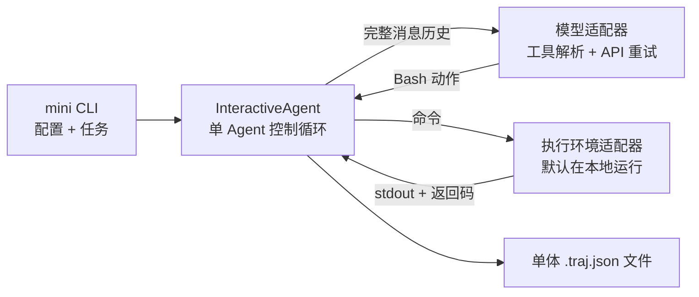

# 上游架构基线

本文档定义 Reliable-MiniSWE 的 P0-07 基线，记录二开修改运行时行为之前，
原版 mini-swe-agent 的架构与能力。后续所有改进结论都应与这份固定实现和
真实运行证据进行比较。

## 范围与证据

- 上游基准提交：`25941c89`
- mini-swe-agent 版本：`2.4.6`
- 检查时的二开分支提交：`f99033d5`
- 源码检查：`src/`、`pyproject.toml` 和 `uv.lock` 与上游基准提交没有差异
- 离线测试证据：[原版离线测试基线](baseline-tests.md)
- 真实任务证据：[原版真实任务基线](baseline-agent-run.md)

本文主要分析默认 CLI 组合：`InteractiveAgent`、模型工厂选择的模型
（通常是 `LitellmModel`）以及 `LocalEnvironment`。其他适配器也遵循精简的
Agent、Model 和 Environment 协议，但在模型供应商或执行环境相关细节上可能不同。

## 组件边界

`mini` 入口负责加载 YAML 配置和命令行覆盖项，分别创建一个模型、一个执行环境和
一个 Agent，再把纯文本任务传给 `agent.run()`。组件之间使用字典传递数据，尚未
定义带版本的任务 Schema 或运行状态 Schema。



`src/minisweagent/__init__.py` 中的协议使三个组件都可以替换。
`agents/__init__.py`、`models/__init__.py` 和 `environments/__init__.py` 中的
工厂既支持简短类型名，也支持完整类路径。这种轻量、可插拔的组合方式是二开时
应当保留的优点。

## Agent 循环

`DefaultAgent.run()` 首先渲染系统消息和包含任务的用户消息，然后反复调用
`step()`，直到最后一条消息的 `role` 为 `exit`。每次 `step()` 只有两个阶段：

1. `query()` 检查运行限制，将当前消息历史发送给模型，统计调用次数和费用，
   再追加模型返回的 assistant 消息。
2. `execute_actions()` 依次执行模型返回的所有动作，将结果格式化为 observation，
   再追加到消息历史。

控制流异常会携带消息写入 trajectory：

- `Submitted`：执行环境检测到任务完成标记。
- `LimitsExceeded`：达到步数或费用限制。
- `TimeExceeded`：达到 Agent 墙钟时间限制。
- `FormatError`：模型响应中没有合法的 Bash 工具调用。
- `UserInterruption`：交互用户中断运行或拒绝执行动作。

对于未捕获的异常，Agent 会先写入一条退出消息并保存 trajectory，然后继续向上
抛出异常。原版循环中没有 Planner，也没有 Implementer/Verifier 职责分离或
确定性验收阶段。

### 完成条件

当某条命令以返回码 0 结束，并且其第一个非空白输出行严格等于以下内容时，
本地和容器执行环境会将任务判定为已提交：

```text
COMPLETE_TASK_AND_SUBMIT_FINAL_OUTPUT
```

该行之后的输出会成为 `submission`。但“已提交”本身不能证明测试通过，也不能
保证生成了 Patch。在交互模式下，Agent 还可以在退出前要求用户确认。

## 消息历史与上下文处理

`DefaultAgent.messages` 是一个内存列表，包含系统提示词、任务、模型响应、工具调用、
观察结果、中断信息和退出消息。每次调用模型时，模型适配器都会移除
mini-swe-agent 私有的 `extra` 元数据，再发送此前积累的全部消息。

默认 observation 模板会限制模型看到的超长命令输出：输出超过 10,000 个字符时，
只保留开头 5,000 个字符和末尾 5,000 个字符，并告知省略的字符数。完整输出仍会
保存在 observation 的 `extra.raw_output` 中，并写入 trajectory。因此，这只是
展示层截断，不是上下文摘要，也没有把大型产物外置存储。

原版针对 Anthropic 模型提供可选的缓存标记，但没有主动 Token 估算、上下文预算、
历史压缩、结构化 Handoff 或记忆检索。`ContextWindowExceededError` 会直接终止
模型调用，不会触发自动压缩。

## 执行环境

执行环境接口接收动作字典，并返回合并后的 stdout/stderr、返回码和可选异常信息。

### 本地执行环境

`LocalEnvironment` 是 `mini` CLI 的默认选择。它使用 `shell=True` 在宿主机执行
模型生成的命令；工作目录来自配置或当前目录，环境变量由宿主机变量与配置变量合并
而成。每个动作都会启动新的子进程，所以 `cd` 或临时环境变量等 Shell 状态不会
自动保留到下一条命令，除非模型在下一条命令中再次显式设置。

默认单条命令超时时间为 30 秒。在 POSIX 系统上，超时处理会杀死整个进程组，并将
超时包装为返回码 `-1` 的 observation。普通非零退出也会成为 observation，供模型
在下一轮自行处理。

本地执行没有文件系统边界、网络限制、资源配额或语义级命令策略。`confirm` 模式会
在执行非白名单命令前询问用户，`yolo` 模式会直接执行，`human` 模式则由用户输入
命令。基于正则表达式的白名单主要用于改善交互体验，不能视为安全沙箱。

### 可选隔离环境

项目还提供 Docker、Singularity、Bubblewrap、SWE-ReX、Modal 和 Contree 适配器。
只有显式选择 Docker 或 Singularity 等适配器时才会获得对应隔离能力，它们不会改变
默认的本地执行行为。这些环境可以配置镜像、工作目录、环境变量和单条命令超时，
Agent 循环本身不依赖具体执行环境。

## 重试与失败处理

默认 LiteLLM 适配器使用 Tenacity 包装模型供应商调用：

- 默认最多尝试 10 次，可通过 `MSWEA_MODEL_RETRY_STOP_AFTER_ATTEMPT` 修改。
- 等待时间采用指数退避，从 4 秒逐渐增加，最大为 60 秒。
- 不支持的参数、资源不存在、权限拒绝、上下文溢出、认证失败和键盘中断会立即终止，
  不参与重试。
- 其他模型调用异常都会重试，没有更细粒度的临时错误与永久错误分类。

模型工具调用格式错误由 Agent 层处理。原始响应和调用费用会被保留，格式反馈也会
追加到消息历史。默认连续出现三次格式错误后退出；任意一次正常 step 都会重置计数。
命令失败和超时没有自动的执行器重试策略：它们只会成为 observation，下一步如何处理
由模型决定。

步数、费用和 Agent 墙钟时间限制会在模型调用前检查，配置为 0 表示不限制。由于费用
只能在模型响应后获知，最后一次调用可能使实际费用超过配置上限。原版没有一等公民的
Token 预算、工具调用预算、单任务资源预算或重复无进展检测。

## Trajectory 与可观测性

`DefaultAgent.save()` 会在每轮循环结束后重写一个 JSON trajectory；异常路径也会
通过 `finally` 执行保存。格式版本 `mini-swe-agent-1.1` 包含：

- 模型调用次数和累计费用；
- Agent、模型和执行环境配置；
- mini-swe-agent 版本、退出状态和 submission 文本；
- 完整消息序列、解析后的动作、原始模型响应、命令输出、返回码、时间戳和异常信息。

这些内容能提供有用的运行后证据，但它仍是一个单体 JSON 快照，而不是 append-only
事件流。写入不是原子的，也没有支持阶段查询的事件 Schema；除现有字段外，系统不会
自动汇总 Token、耗时、工具失败次数或终止原因。此外，原版没有 checkpoint 加载器或
resume 命令。

## 实测基线

| 检查项 | 结果 |
|---|---|
| 无凭证核心离线测试 | 514 passed，14 skipped，58 deselected，0 failed |
| 真实任务 | 修复 `weather.py` 启动时的 `HTTPError` |
| 真实任务终止状态 | `Submitted` |
| 真实任务模型调用次数 | 7 |
| 真实任务 Token | 总计 26,882 |
| 真实任务记录费用 | 0.013366144 |
| 真实任务 trajectory 耗时 | 168.124 秒 |

真实任务证明这个精简循环能够成功检查、修改和测试一个项目，同时也暴露了“模型声明
完成”与“确定性验收”之间的区别：Agent 主动执行了有效检查，但没有独立 Verifier
强制验收，而且 trajectory 中的 `submission` 字段为空，最终 Patch 需要单独保存。

## 已知局限与二开目标

| 原版基线局限 | Reliable-MiniSWE 二开目标 |
|---|---|
| 输入是一个非结构化任务字符串，状态是一个可变消息列表 | 类型化 TaskSpec 和带版本的运行状态 |
| 同一个 Agent 同时负责编码和宣布完成 | 独立 Implementer/Verifier 裁决循环 |
| 完成标记不能证明结果正确 | 确定性验证和明确的终止状态 |
| 全量历史不断增长，直到模型供应商拒绝请求 | Token 预算、输出外置、上下文压缩和 Handoff |
| 没有 checkpoint 加载和断点恢复 | 原子 checkpoint 与幂等 resume |
| 默认本地 Shell 可以访问宿主机和网络 | 工具策略预检及隔离、限额执行 |
| confirm、yolo 和正则检查不能构成策略引擎 | 可审计的 `ALLOW / DENY / ASK` 决策 |
| 原始输出和配置没有通用脱敏层 | 凭证保护与 Trace 脱敏 |
| 模型重试依赖异常名单，工具失败依靠模型判断 | 明确区分临时/永久错误并检测无进展循环 |
| 费用可能超限，且没有 Token 或工具预算 | 统一管理步数、Token、费用、时间和工具预算 |
| 每次重写完整 trajectory | append-only JSONL 事件和派生汇总 |
| 不强制测试，也不保证保存 Patch | Verifier 证据、Patch 捕获和可复现评测 |

## 兼容性要求

二开应保留原版基线已经证明有价值的特性：

- 简单且可替换的 Agent、Model 和 Environment 边界；
- 适合小型任务的轻量 CLI 路径；
- 模型调用和命令执行的完整证据；
- 可配置的本地与隔离执行适配器；
- 明确的命令超时行为和完整终止记录；
- 与无凭证上游测试基线保持兼容。

后续有关性能、可靠性、安全性和成本的结论，都必须与本文链接的固定命令和证据产物
比较，不能依靠未记录的主观印象。
